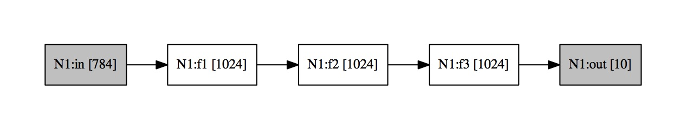
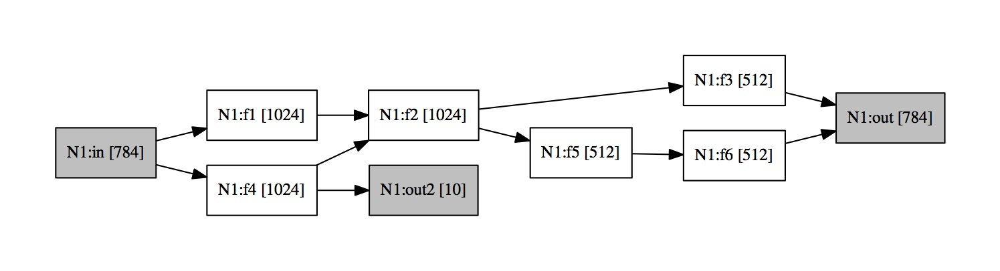
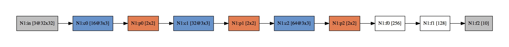
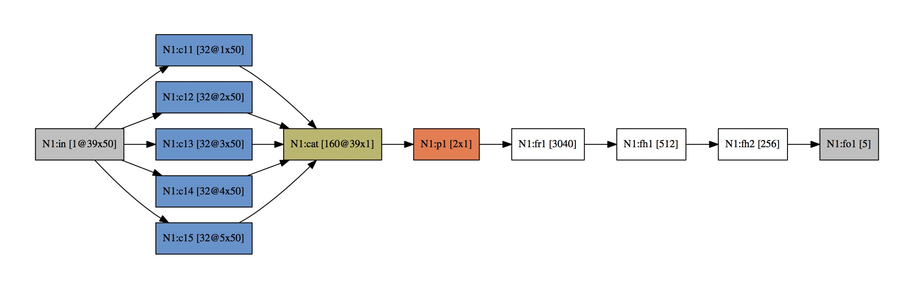

# LAYERS TUTORIAL

**NOTE:** Along this tutorial will appear some **ADVANCED** features that are not necessary for the normal use of Layers but are important to show the toolkit flexibility and potential.

## Basic

* There are 4 main parts in a layer program:
	* constants
	* data
	* networks
	* scripts

&nbsp;
&nbsp;
&nbsp;
&nbsp;

## Constants

* There are different constants to setup and control different features of Layers:
	* threads: number of threads for parallelization for CPU backend (4)
	* batch size: size of the batch for the network (100)
	* log: log file where some messages are saved (netparser.log)
	* seed: random seed (1234)
	* device: {cpu,gpu} to select the backend
	

~~~c
const{
 threads=8     // #threads to use
 batch=100     // batch size
 device=cpu    // device {cpu,gpu}
 log="all.log" // log file
 seed=2329     // seed for random
}
~~~

&nbsp;
&nbsp;
&nbsp;
&nbsp;
## Data

### Data from File

* Data can be read in ascii or binary. Data format is the following:

>  samples dim output
> 
>  sample1\_1 ... sample1\_dim out1\_1 .. out1\_c
> 
>  ...
> 
>  samplen\_1 ... samplen\_dim outn\_1 .. outn\_c

* _samples_ is the number of samples (int)
* _dim_ is the dimensionality of the samples (int) 
* _out_ is the number of output targets, classes in a classification problem (int)
* each row is a sample (float values)

**Note**: when samples are color images the channels appear separated, first R, then G and then B and _dim_ must be $3\times rows\times cols$

* An example of a data file (ascii format) with 10 samples. Each sample is represented by a 3-dim vector (feature vector). The targets are vectors of 2-dim values:

~~~c
10 3 2
1.0 0.0 2.4 0.1 0.5
2.3 2.2 1.2 0.5 1.2
-1.2 2.2 0.6 2.1 -1.0
1.0 0.0 2.4 0.1 0.5
2.3 2.2 1.2 0.5 1.2
-1.2 2.2 0.6 2.1 -1.0
1.0 0.0 2.4 0.1 0.5
2.3 2.2 1.2 0.5 1.2
-1.2 2.2 0.6 2.1 -1.0
1.0 0.0 2.4 0.1 0.5
~~~

* In case of being a classification problem the targets are real values but a unique "1" for the correct class and "0" for the rest:

~~~c
10 3 2
1.0 0.0 2.4 0 1
2.3 2.2 1.2 0 1
1.2 2.2 0.6 1 0
1.0 0.0 2.4 0 1
2.3 2.2 1.2 1 0
1.2 2.2 0.6 0 1
1.0 0.0 2.4 0 1
2.3 2.2 1.2 0 1
1.2 2.2 0.6 1 0
1.0 0.0 2.4 1 0
~~~

* **Note:** ascii format can be converted to binary format with the __ascii2bin__ tool provided

* Data file can be used in layers using a data block. An example of data block:

~~~c
data {
  D1 [filename="../training", binary]
  D2 [filename="../test", binary]
  Dval [filename="../valid", ascii]
}
~~~

* _D1_, _D2_ and _Dval_ are the name of the data variables

&nbsp;

> **ADVANCED**  
>### Generative Data
>In the Data block we can define generative data to be used in Layers as random noise input for >instace. Generative data has a batch size. Number of rows is the size of the batch and the number >of dims can be parametrized when it is created. 
>
>The generative data can be random:{gaussian, uniform} or fixed:{zeros, ones, onehot}. Some >examples:

~~~c
Data {
// Generative Data. Data with just one batch of samples and 200 dims
  DZ  [zeros, numnodes=200]          // ... all zeros
  DO  [ones, numnodes=200]           // ... all ones
  DG  [gauss, numnodes=200]          // ... gaussian distribution N(0,1)
  DU  [uniform, numnodes=200]        // ... uniform distribution [0:1]
  DH  [oneshot, numnodes=200, pos=15] // ... all zeros but one 1 at position 15
}
~~~
>
>
>### Empty Data 
>
>Also new data with some size can be defined in order to set values inside later:
>
~~~c
Data {
  // Create a new Data with 100 rows, 1024 dims and 0 targets
  DN [nrows=100,ncolsample=1024,ncoltarget=0]
}
~~~

&nbsp;
&nbsp;
&nbsp;
&nbsp;
&nbsp;
&nbsp;
&nbsp;
## Networks

* Networks are composed by three main parts:
	* Data
	* Layers
	* Connections
* The networks are defined like this:

~~~c
network N1 {  
   ...
}
~~~

* where _N1_ is the name of the network

## Networks - Data

~~~c
network N1 {  
  //data
  data tr D1  //optional
  data ts D2 //optional
  data va Dval //optional
  ...
}
~~~

* When tr data is provided, that dataset will be used as training data. 
* When ts or va data are provided the error function of the net will be also evaluated for that data sets

## Networks - Layers

* There are different layers that can be created:

	|  Layer | Type|
	|--------|----------------------------|
	|**FI** | Input Fully Connected layer|
	 **CI** | Input Convolutional layer
	 **F**  | Fully Connected layer
	 **FO** | Output layer
	 **C**  | Convolutional layer
	 **MP** | MaxPooling layer
	 **CAT**| Convolutional Cat layer
	 **ADD**| Convolutional Add Layer
	 ***O***| Operator Layer

### Networks - Layers - FI

* FI serve as a connection with the data. When no data is defined in the network then it is mandatory to pass the data as a parameter to FI.

~~~c
//NETWORK
network N1 {  
  //data
  data tr D1  

  // Fully Connected Input 
  FI in 
  ...
}
~~~

OR

~~~c
//NETWORK
network N1 {  
  // Fully Connected Input 
  FI in [D1]
  ...
}
~~~

* _in_ is the name of the layer
* The number of units is the dimensionality of the data

&nbsp;

> **ADVANCED**   
> But also an input layer can be connected to a layer from another network:

~~~c
 network N1 {  
  // Fully connected input 
  FI in [D1]
  // Fully connected hidden layer
  F f1 [numnodes=1024]
  ...
}
network N2 {  
  // Fully Connected Input 
  FI in [N1.f1]
  ...
}
~~~ 
>
>
&nbsp;

### Networks - Layers - CI

* Convolutional input has three mandatory parameters that indicate how the raw data has to be mapped into an input Map
* The parameters are: 
	* nz: number of channels
	* nr: image rows
	* nc: image cols

~~~c
//NETWORK
network N1 { 
  //data
  data tr D1 

  // Convolutional Input for MNIST
  CI in [nz=1, nr=28, nc=28]
  ...
}
~~~

OR

~~~c
//NETWORK
network N1 { 
  // Convolutional Input for MNIST
  CI in [D1,nz=1, nr=28, nc=28]
  ...
}
~~~

* _in_ is the name of the layer

* Convolutional input has optional parameters:
	* cr: crop rows
	* cc: crop cols
* Images will be randomly cropped on training phase
* Images will be center-cropped in test phase

~~~c
//NETWORK
network N1 { 
  //data
  data tr D1 

  // Convolutional Input for MNIST
  // Images will be randomly cropped to 24x24
  CI in [nz=1, nr=28, nc=28, cr=24, cc=24]
  ...
}
~~~

### Networks - Layers - F

* A fully connected layer

~~~c
//NETWORK
network N1 {  
  //data
  ...
  
  // Fully connected
  F  f1 [numnodes=1024]
  ...
}
~~~
* _f1_ is the name of the layer
* _numnodes_ is a mandatory parameter in regular hidden layers but can be avoided when defining a **reshape** layer after a convolutional layer

### Networks - Layers - FO

* FO is an output target where loss are computed.
* When no data is defined in the network then it is mandatory to pass the data as a parameter to FO.
* The dimensionality of this FO Layer is the number of targets in that dataset.
* FO has a mandatory parameter _{classification,regression,autoencoder}_ that define the cost error.

~~~c
network N1 {  
  data tr D1 // Data defined in the Network
  
  // Targets are the output in data (one-hot) 
  FO  out1 [classification]  // Cross-entropy

  // Targets are the output in data (real values) 
  FO  out2 [regression]  // mse over output

  // Targets are the same input in data
  FO  out3 [autoencoder]	// mse over input
 ...
}
~~~

OR specifying the data:

~~~c
network N1 {  
  ... // Data not defined in the network
  // Targets are the output in data (one-hot) 
  FO  out1 [D1,classification]  // Cross-entropy
}
~~~

### Networks - Layers - C

* Convolutional layers have three mandatory parameters:
	* nk: number of kernels
	* kr: height of kernel
	* kc: width of kernel

~~~c
network N1 { 
  ...
  // Convolutional Layer
  C c1 [nk=32, kr=3, kc=3]	  
  ...
}
~~~

* _c1_ is the name of the layer
* Convolutional layers have the following optional parameters:
	* rpad: indicates if padding is done in the rows (0)
	* cpad: indicates if padding is done in the cols (0)
	* stride: stride value (1)

~~~c

network N1 { 
  ...
  // Convolutional Layer with padding
  // To keep the same size of Input Maps 
  // use rpad=cpad=1
  C c1 [nk=32, kr=3, kc=3,rpad=1,cpad=1]	  

  // Stride=2 and only padding in cols
  C c2 [nk=32, kr=3, kc=3,cpad=1,stride=2]	  
  ...
}
~~~

###  Networks - Layers - MP

* MaxPool layers have two mandatory parameters:
	* sizer: height of the pooling region
	* sizec: width of the pooling region

~~~c
network N1 { 
  ...
  // Maxpool layer sizer=sizec=2
  MP p1[sizer=2,sizec=2]
  ...
}
~~~

###  Networks - Layers - CAT

* Cat layers does not require any parameter

~~~c
network N1 { 
  ...
  // Convolutional CAT Layer
  CAT c
  ...
}
~~~

###  Networks - Layers - ADD

* ADD layers does not require any parameter

~~~c
network N1 { 
  ...
  // Convolutional ADD  Layer
  ADD a
  ...
}
~~~

&nbsp;

> **ADVANCED**   
>###  Networks - Layers - O
>
>* **Operator** layers requires one parameter, the operator:
>
>  Operator | Meaning
>-----------|----------
>*add* | Add the layers connected to the Operator 
>*sub* | Substraction of the layers (2) 
>*imult* | Element multiplication (2)
>*omult* | Outter product of the layers (2)
>*div*   | Element division of the layer connected (1)
>*tanh*  | Tanh activation of the layer connected (1)
>*sigmoid* | Sigmoid activation of the layer connected (1)
>*relu* | Relu activation of the layer connected (1)
>*log* | Log of the layer connected (1)

~~~c
network N1 { 
  ...
  // Operator Layer
  O o1 [add]
  ...
}
~~~
&nbsp;

## Networks - Connections

* To connect two layers use the symbols "->"

~~~c
network N1 { 
  ...
  c1->c2
}
~~~

## Networks - Examples

#### Example 1 - MLP MNIST
~~~c
// A typical MLP for MNIST
// 784->1024->1024->1024->10

//CONSTANTS
const{
  threads=8
  batch=10
  log="mnist.log"
}

// DATA FILES
data {
  D1 [filename="../training", binary]
  D2 [filename="../test", binary]
}

//NETWORK
network N1 {  
  //data
  data tr D1  //mandatory
  data ts D2 //optional

  // Fully Connected Input 
  FI in 
  
  // Fully connected
  F  f1 [numnodes=1024]
  F  f2 [numnodes=1024]
  F  f3 [numnodes=1024]
  
  // Fully Connected Output
  FO  out [classification]  

  // Links
  in->f1
  f1->f2
  f2->f3
  f3->out
}
~~~

* layers generates a _dot_ file with the name of each network
* Use " dot -T pdf N1.dot > N1.pdf" to generate a PDF with the network:

* but yes, more complicated networks can be defined

#### Example 2 - Hybrid MLP MNIST

~~~c
//NETWORK
network N1 {
  //data
  data tr D1  
  data ts D2 

  // Fully Connected Input
  FI in

  // Fully connected
  F  f1 [numnodes=1024]
  F  f2 [numnodes=1024]
  F  f3 [numnodes=512]

  // Fully connected
  F  f4 [numnodes=1024]
  F  f5 [numnodes=512]
  F  f6 [numnodes=512]

  // Output
  FO  out [regression,autoencoder]
  FO  out2 [classification]

  // Connections
  in->f1
  f1->f2
  f2->f3
  f3->out

  in->f4
  f4->f2
  f4->out2

  f2->f5
  f5->f6
  f6->out

}
~~~

#### Example 3 - Convolutional CIFAR

~~~c
network N1 {
  data tr D1
  data ts D2

  CI in [nz=3, nr=32, nc=32]

  C c0 [nk=16, kr=3, kc=3]
  MP p0[sizer=2,sizec=2]
  C c1 [nk=32, kr=3, kc=3]
  MP p1 [sizer=2,sizec=2]
  C c2 [nk=64, kr=3, kc=3]
  MP p2 [sizer=2,sizec=2]

  // FC reshape, numnodes is not required
  F   f0 []

  // FC hidden
  F  f1 [numnodes=128]

  // FC output
  FO f2 [classification]

  // Connections
  in->c0
  c0->p0
  p0->c1
  c1->p1
  p1->c2
  c2->p2
  //reshape
  p2->f0
  f0->f1
  f1->f2

}
~~~

#### Example 4 - CAT layers 
~~~c
network N1 { 
  data tr D1 
  data ts D2

  CI in [nz=1, nr=39, nc=50]

  C c11 [nk=32, kr=1, kc=50,rpad=1]       
  C c12 [nk=32, kr=2, kc=50,rpad=1]       
  C c13 [nk=32, kr=3, kc=50,rpad=1]       
  C c14 [nk=32, kr=4, kc=50,rpad=1]       
  C c15 [nk=32, kr=5, kc=50,rpad=1]       
  MP p1 [sizer=2,sizec=1]        

  CAT cat 
  
  // FC reshape
  F   fr1 []    

  // FC hidden
  F  fh1 [numnodes=512]
  F  fh2 [numnodes=256]

  // FC output
  FO fo1 [regression]

  // Connections
  in->c11
  in->c12       
  in->c13
  in->c14
  in->c15

  c11->cat
  c12->cat
  c13->cat
  c14->cat
  c15->cat

  cat->p1

  p1->fr1
  fr1->fh1
  fh1->fh2
  fh2->fo1

}

~~~

&nbsp;
&nbsp;
&nbsp;
&nbsp;
## Scripts

Script is a Layer block where the user run commands. There are commands associtated to networks, data, variables and expressions

### Variables and Expressions

Layers allows to use variables and evaluate mathematical expressions:

~~~c
script {
 i=3.5
 j=log(i)
 echo "j="
 echo j
 echo -n
}
~~~

will produce the following output:

~~~
j= 1.870829 
~~~

### Data access and manpulation

An example of things we can do to data:

name | action
-----|-----
**add**  | add value
**sub**  | substract value
**mul**  | multiply value
**div**  | divide value
**zscore** | normalize mean=0 and sd=1
**maxmin** | normalize min=0 and max=1
**center** | normalize mean=0
**getstats** | copy stats from other data

This functions can be apply to all the data or a **range** of the data. To define a range you can use the **[..]** operator. The range operator must have two parameters: rows and cols, **[row,col]**. And user can define intervals of rows and cols: **[row1:row2,col1:col2]**. Especial cols are "S" and "T" for fetures(dim) and targets(out) respectivelly. 

**IMPORTANT** In a Data with 100 dims and 10 outs, the first 100 cols are dims and the next 10 cols are targets. Terefore "S" will refer to cols 1:100 and "T" will refer to cols 101:110. 

Some examples:

~~~c
script {

 // Data modifications
 // Ranges [rows,cols] - [row1:row2,col1:col2].
 // Special ranges for columns S(dims) and T(targets)

 D1[:,S].div(255.0)  // Divide the all the dims but not targets
 D2[:,S].div(255.0)  // " " " " " 

 D1[:,T].div(2.0)    // Divide the all the targets
 D1[:,T].mul(2.0)    // Multiply all the targets
 D1[:,T].add(1.0)    // Add 1.0 to all the targets
 D1[:,T].sub(1.0)    // Substract 1.0 to all the targets

 D1[:,:].mul(1.0)    // Multiply ALL the data (dims and targets) !!
 D1.mul(1.0)         // The same: Multiply ALL the data (dims and targets) !!

 D1[:,1:1].set(0.0)  // Set the first col to 0.0 for all samples
 D1[:,1].set(0.0)    //  " " " "

 // Varibles and expressions accepted:
 i=0
 D1[:,i+1].set(0.0)
 
 // Data transformation, usually only to dims not to targets
 D1[:,S].zscore()   // Zscore: substract mean and divide by standar deviation
 D2.getstats(D1)    // Copy statistics from D1
 D2[:,S].zscore()   // Zscore of D2 using D1 statistics (copied just before)

 D1[:,S].center()   // Center: substract mean
 D2.getstats(D1)    // Copy statistics from D1
 D2[:,S].center()   // Center with D1 statistics

 D1[:,S].maxmin()   // Normalize [0,1]. min=0 max=1
 D2.getstats(D1)    // Copy statistics from D1
 D2[:,S].maxmin()   // Normalize with D1 statistics

~~~

Beyond the modifications of the values you can copy and create new data from another:

~~~c
 // Data manipulation. D3 and D4 have not been defined previously.
 D3.copy(D1)            // Create a new Data copy from D1
 D4.copy(D1[1:100,:])   // Create a new Data copy from some rows of D1

 // Copying blocks between datasets. D1 and D2 both exit previously.
 D1[1:10,31:100].copy(D2[21:30,101:170])
~~~

### Data other functions and parameters

* next(): is a data funciton to provide the next batch.
* shuffle(): is a data funciton to shuffle the samples (rows)
* balance: is a data parameter to balance the classes in unbalanced classification sets

~~~c
scripts {
	D1.balance=0

	D1.next()
	D1.shuffle()
}
~~~

### Network functions 

|Function | Meaning|
|----------| -----------|
|**train** |  train a number of epochs|
**forward** | perform a forward through all the network
**printerrors** | print the errors
**reseterrors** | reset the errors
**backward** | perform a backward through all the network
**update** | perform a weights update with gradients
**resetstats** | reset the batch norm stats
**evaluate** | to evaluate the network with other dataset (test)

* An example over MNIST with one FC layer with 1024 units:

~~~c
const{
 threads=8     // #threads to use
 batch=100     // batch size
 device=cpu    // device {cpu,gpu}
 log="all.log" // log file
 seed=2329     // seed for random
}

data {
  // Load a binary file with MNIST
  D1 [filename="training.bin", binary]
  D2 [filename="test.bin", binary]
}

network N1 {
 data tr D1
 data ts D2
 FI in 
 F f1 [numnodes=1204]
 FO outc [classification]

 in->f1
 f1->outc
}
~~~

The easy way:

~~~c
script {
	D1[:,S].div(255.0) 
 	D2[:,S].div(255.0) 

	N1.train(10)  // train 10 epochs
}
~~~

The atomic way:

~~~c
script {

	D1[:,S].div(255.0)  
 	D2[:,S].div(255.0)  

	batches=60000/100      	
 	epoch=10

	for e=1:epoch {
 		D1.shuffle()
 		N1.reseterrors()
 		for i=1:batches {
     		D1.next()
    		N1.forward()
     		N1.backward()
      		N1.update()
     	}
 		N1.printerrors()
 		N1.evaluate(D2)
 	}
	
}
~~~

### Network parameters

|parameter | meaning|
|----------| -----------|
|**mu** |  learning rate. Scaled by batch size [0.0001/batch_size]|
**mmu**| momentum rate [0.9]
**l2** | l2 regularization (weight decay) [0.0]
**l1** | l1 regularization	[0.0]	
**maxn**| maxnorm regularization [0.0]
**noiser**| noise ratio after activation function [0]
**noisesd**| standard deviation of noise ($N(0.0,\sigma)$) [0]
**drop**| dropout (0<drop<=1) [0.0]
**bn** | batch normalization ({0,1}) [0]
**act**| activation (0 Linear, 1 Relu, 2 Sigmoid, 3 ELU) [1]
**flip**| to flip horizontally input images ({1,0}) [0]
**shift**| to shift randomly input images [0]
**lambda**| to scale the cost function

* Parameters can be modified for one particular layer or data:

~~~c
script{
...
N1.c2.drop=0.5
N1.in.flip=1
N1.in.shift=2
N1.in.noiser=0.2 
...
}
~~~

* Or, parameters can be modified for **all** the layers of the same network:

~~~c
script{
...
N1.mu=0.001
N1.l2=0.0005
N1.noiser=0.5
N1.noisesd=0.3 
...
}
~~~

**Some considerations when parameter is apply the network**

* *drop* parameter does not affect to output layer
* *bn* parameter does not affect to input and reshape layer
* *flip* only affect to input layer
* *act* parameter does not affect to input, reshape and output layers

&nbsp;
&nbsp;
&nbsp;
&nbsp;
# The whole picture

#### Example 1

~~~c
// A typical MLP
// 784->1024->1024->1024->10
// Check N1.dot and get a pdf of the net with: 
// dot -T pdf N1.dot > N1.pdf

//CONSTANTS
const{
  threads=8
  batch=10
  log="mnist.log"
}

// DATA FILES
data {
  D1 [filename="../training", binary]
  D2 [filename="../test", binary]
}

//NETWORK
network N1 {  
  //data
  data tr D1  //mandatory
  data ts D2 //optional

  // Fully Connected Input 
  FI in 
  
  // Fully connected
  F  f1 [numnodes=1024]
  F  f2 [numnodes=1024]
  F  f3 [numnodes=1024]
  
  // Fully Connected Output
  FO  out [regression]	

  // Links
  in->f1
  f1->f2
  f2->f3
  f3->out
}

//RUN SCRIPT 
script {
  
  D1[:,S].div(255)
  D2[:,S].div(255)

  N1.noisesd=0.3
  N1.noiser=1.0
  N1.mu=0.01
  
  N1.train(10)

}
~~~

#### Example 2

~~~c
const {
threads=4
batch=100
}
data {
  D1 [filename="training", binary]
  D2 [filename="test", binary]
}

network N1 { 
  data tr D1 
  data ts D2

  // Convolutional Input
  CI in [nz=3, nr=32, nc=32]

  C c0 [nk=16, kr=3, kc=3]	  
  MP p0[sizer=2,sizec=2]
  C c1 [nk=32, kr=3, kc=3]	  	 
  MP p1 [sizer=2,sizec=2]
  C c2 [nk=64, kr=3, kc=3]		
  MP p2 [sizer=2,sizec=2]
  
  // FC reshape
  F   f0 []	

  // FC hidden
  F  f1 [numnodes=128]

  // FC output
  FO f2 [classification]

  // Connections
  in->c0
  c0->p0 
  p0->c1
  c1->p1
  p1->c2
  c2->p2
  //reshape
  p2->f0
  f0->f1
  f1->f2

}

// RUN
script {
  
   
  D1[:,S].div(255)
  D2[:,S].div(255)

  N1.mu=0.1
  N1.in.noiser=1.0
  N1.in.noisesd=0.3
  N1.bn=1
  
  N1.train(1000)
}

~~~

&nbsp;
&nbsp;
&nbsp;
&nbsp;

## ADVANCED ISSUES

### FOR Loops

The syntax is the following

~~~c
for variable ini:step:end {
	//instructions
}
~~~

step is optional, for instace:

~~~c
for i=1:2:3 {
  for j=1:5 {
   echo i
   echo j
   echo -n
   }
 }
~~~

will produce:

~~~c
1 1 
1 2 
1 3 
1 4 
1 5 
3 1 
3 2 
3 3 
3 4 
3 5 
~~~

### IF - ELSE

### Atomic Operators

### Networks sharing layers

Layers can be shared among networks.  

