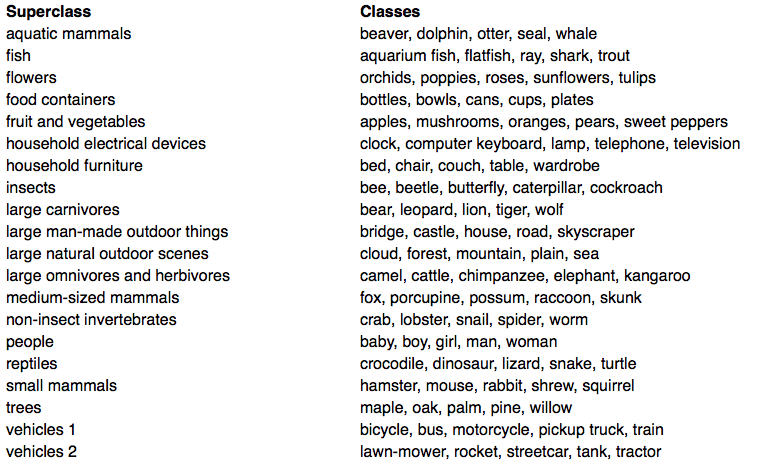

## CIFAR-100

* A classification problem over 100 classes
* Images: RGB 32x32
* Training set: 50k images
* Test set: 10k images

Download data:

* [Training](http://users.dsic.upv.es/~rparedes/DeepLearning/data/CIFAR-100/training)
* [Test](http://users.dsic.upv.es/~rparedes/DeepLearning/data/CIFAR-100/test)

