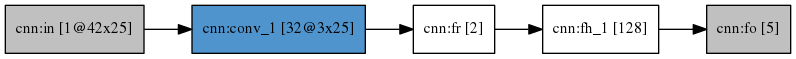
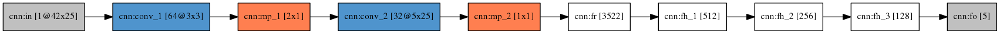

## Templating system for creating neural networks 

This is a *nix based python script that would help you writing your NN files.

**Dependencies:**
- jinja2=2.8=py35_1
- markupsafe=0.23=py35_2
- openssl=1.0.2h=1
- pip=8.1.2=py35_0
- python=3.5.1=5
- readline=6.2=2
- setuptools=23.0.0=py35_0
- sqlite=3.13.0=0
- tk=8.5.18=0
- wheel=0.29.0=py35_0
- xz=5.2.2=0
- zlib=1.2.8=3

All dependencies can be installed using the following conda command:
```sh
conda env create -f environment.yml
```
Then, the envirnment is activated by the following command:
```sh
source activate layers
```
## Basic walkthrough
This script accepts the following parameters:
- *id* (-i): name of the network that you'll be creating
- *architecture* (-a): define your architecture joining layers using the special character '->'. [Learn how to define an architecture](#architecture-definition)
- *training filepath* (-tr) : Filepath where the training dataset is found.
- *test filepath* (-ts) : Filepath where the test dataset is found.

This is an example of the parameters required:
```sh
python template.py -i cnn -a 'ci(1x42x25)->fr->fh(512)->fh(256)->fh(128)->fo(regression)' -tr train.txt -ts test.txt
```

After executing the script the NN would be written in a file named *id*.net. Then, the user can modify the NN to change values not covered by this script. 

## Architecture definition
The neural network architecture will be defined connecting layers with the special character '->'. To learn more about the parameters acceptable for each layer type, please check the [tutorial](https://github.com/RParedesPalacios/Layers/tree/master/Tutorial).


### Layers without parameters:
* **fr:  Fully connected reshape layer**. An example of this layer is: ```fr```

### Layers with parameters:
These layers accept parameters. The special character 'x' splits each parameter, except in the case of the convolutional layers where the symbol '_' is used to discriminate between the kernel size and the padding options. 
* **ci:  Input Covolutional layer**. Only _one_ covolutional input layer must be defined. 
The values accepted are (in order of appearance):
	* _nz_: number of channels.
	* _nr_: image rows.
	* _nc_: image cols.
	
	An example of a input convolutional layer with 1 channel, 42 rows, and  25 columns: ```ci(1x42x25) ```

* **c:  Convolutional layer**. The user can define multiple covolutional layers. 
The values accepted are (in order of appearance):
	* nk: number of kernels.
	* kr: height of kernel.
	* kc: width of kernel.

    An example of a convolutional layer with 32 kernels, each one of them of size  3x25 (3 is the heigth and 25 the width of the kernel): ```c(32x3x25)```
    
    If only two parameters are provided the script would assume that the user defined an square kernel with the same height and width. An example of a convolutional layer with 64 kernels, each one of size 3x3:```c(64x3)```
    
    If the user wants to use **padding** the parameters would be defined after de special character '_'. The values accepted are (in order of appearance): 
    * rpad: indicates if padding is done in the rows (0).
	* cpad: indicates if padding is done in the cols (0).

    An example of a convolutional layer with 32 kernels, each one of them of size 5x25 with row and column padding: ```c(32x5x25_1x1)```
    
* **mp:  MaxPooling layer**. The user can define multiple covolutional layers. 
The values accepted are (in order of appearance):
	* sizer: height of the pooling region.
	* sizec: width of the pooling region.
	 
	 An example of a maximum pooling layer of size 2x1 (2 is the height and 1 is the width of the pooling region): ```mp(2x1)```

* **fh:  Fully Connected layer**. The user can define multiple fully connected layers. 
The value accepted is:
   * _numnodes_: number of nodes found in this layer.
 
    An example of a fully connected layer with 128 nodes:```fh(128) ```

* **fo:  Ouput layer**. Only _one_ output layer must be defined. 
The value accepted is:
    * _task type_: there are two possible values _{classification,regression}_
    
    An example of an output layer for performing regression: ```fo(regression)```

### Examples 
This architecture takes as an input a matrix of 42x25 with one channel and trains a classification NN. 
```
ci(1x42x25)->c(32x3x25)->fr->fh(128)->fo(classification)
```
The neural network generated has the following scheme:



Another example would be this architecture definition:
```
ci(1x42x25)->c(64x3x3)->mp(2x1)->c(32x5x25_1x1)->mp(1x1)->fr->fh(512)->fh(256)->fh(128)->fo(regression)
```
And the neural network generated has the following scheme:

